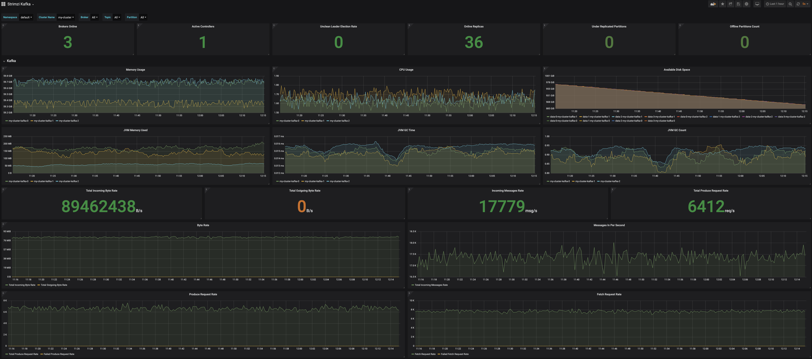

# Setup Instructions for Stirmzi (Kafka) over AWS EKS

This readme document details various steps I had to take to get end to end Kafka working in EKS with Strimzi.

## k8s deployment

To make my initial EKS deployments easy, following is the list of steps I had to take to deploy a heterogenous Kafka cluster.

   1. Manual - AWS Console - Create a VPC with 6 subnets (3 private, 3 public - one for each AD), update their route tables, add internet gateway, nat gateway, acls and SGs. - This can be automated via Terraform later.
   2. Using `eksctl` deploy an EKS cluster with 4 different node groups in the pre-existing subnets. `eksctl` also can provision these subnets and VPC on your behalf.

Also available in [eks-cluster.sh](eks-cluster.sh)
```
# create cluster with an initial nodegroup
eksctl create cluster \
--region ap-southeast-1 \
--vpc-public-subnets subnet-1,subnet-2,subnet-3 \
--vpc-private-subnets subnet-4,subnet-5,subnet-6 \
--name expt-strimzi-kafka \
--version 1.13 \
--nodegroup-name cluster-operators \
--node-type c5.xlarge \
--nodes 3 \
--node-ami auto \
--ssh-access \
--auto-kubeconfig

eksctl create nodegroup \
--region ap-southeast-1 \
--cluster expt-strimzi-kafka \
--version auto \
--name zookeepers \
--node-type r5.xlarge \
--node-ami auto \
--nodes 3

eksctl create nodegroup \
--region ap-southeast-1 \
--cluster expt-strimzi-kafka \
--version auto \
--name kafka-brokers \
--node-type r5.2xlarge \
--node-ami auto \
--nodes 3

eksctl create nodegroup \
--region ap-southeast-1 \
--cluster expt-strimzi-kafka \
--version auto \
--name kafka-producers \
--node-type c5.2xlarge \
--node-ami auto \
--nodes 6

# update local kubeconfig for kubectl commands
aws --region ap-southeast-1 eks update-kubeconfig --name expt-strimzi-kafka
```

To delete the cluster after experimentation
```
eksctl delete cluster \
--region ap-southeast-1 \
--name expt-strimzi-kafka
```

## pre-configurations

   1.  Add `st1` storage class for EBS and make it default using [aws-ebs-storageclasses.yaml](aws-ebs-storageclasses.yaml)
   ```
   kubectl apply -f aws-ebs-storageclasses.yaml
   ```
   2. Install tiller and helm locally with Instructions in section below.

### Running tiller and helm locally to install packages
Based on https://docs.aws.amazon.com/eks/latest/userguide/helm.html
Run tiller and helm locally to serve and install charts:

Configure tiller port and namespace: [ns-tiller.sh](ns-tiller.sh)
```
source ./ns-tiller.sh
```

Start local tiller server: [tiller.sh](tiller.sh)
```
./tiller.sh
```

Initialize helm on client: [helm.sh](helm.sh)
```
./helm.sh
```

Serve local helm repo: [serve-helm.sh](serve-helm.sh)
```
./serve-helm.sh
```

## stirmi-kafka-operator
After making any necessary changes (in our case we just changed affinity to make sure it gets launched on our operator nodes), publish the helm chart to local directory that helm can serve as local repository.

Right now all the affinity are associated with `instance-type` as EKS adds those labels automatically. While `eksctl` provides it's own labeling, it might be worthwhile to setup these labels in whatever infrastructure provisioning choice you have.

Package the helm chart for Strimzi:
```
helm package ~/gopath/src/github.com/strimzi/strimzi-kafka-operator/helm-charts/strimzi-kafka-operator -u -d ~/.helm/charts/
```

Deploy the Strimzi Kafka operator on your cluster (remove --dry-run):
```
source ./ns-tiller.sh
helm upgrade --dry-run --debug --install strimzi-kafka-operator local/strimzi-kafka-operator
```

## kafka-jbod
Deploy the updated kafka-jbod.yaml at [examples/kafka/kafka-jbod.yaml](../kafka/kafka-jbod.yaml), it has jbod config, kafka prod config, metrics config and affinity that will deploy both kafka and zookeepers
```
kubectl apply -f kafka-jbod.yaml
```

## monitoring - prometheus & grafana
Deploy prometheus using operator model from [metrics/examples/prometheus/setup-prometheus.sh](../../metrics/examples/prometheus/setup-prometheus.sh)

Deploy grafana using [metrics/examples/grafana/grafana.yaml](../../metrics/examples/grafana/grafana.yaml)

## kafka producer test
[kafka-producer.yaml](kafka-producer.yaml)
```
kubectl apply -f kafka-producer.yaml
```

## results

